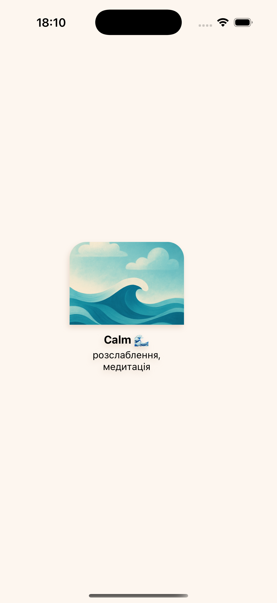
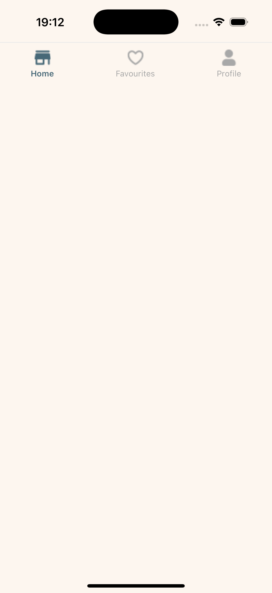
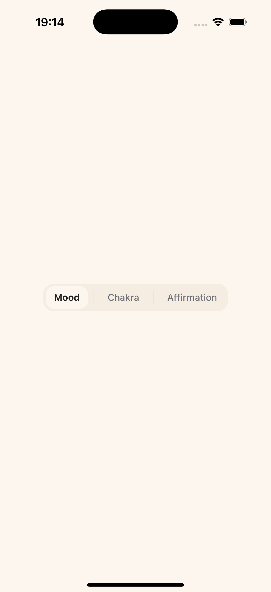
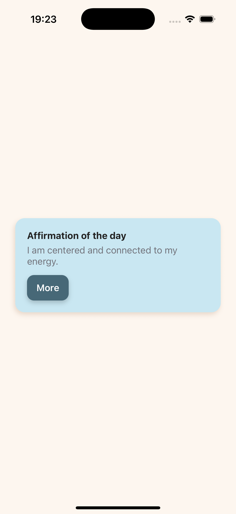
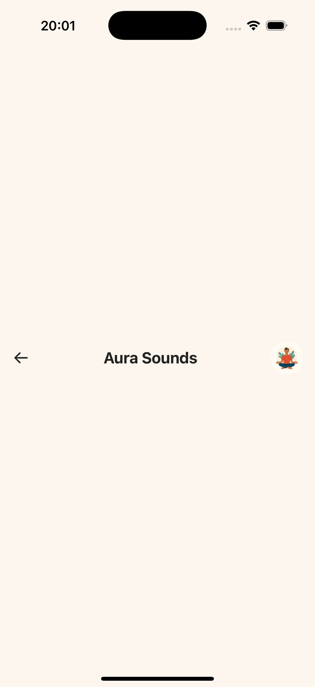

# AuraSounds

**AuraSounds** is a mobile application for restoring inner balance through music, affirmations, and practices related to mood and chakras.

## Features
- Thematic playlists for different emotional states (Calm, Inspired, Focused, Clear, etc.)
- Categories of affirmations and chakras
- Components implemented in the Figma design style with responsive styling

## Contents
This repository includes:
- Implemented React Native components: `CustomButton`, `Card`, `TabBar`, etc.
- Style and color theme files in `constants/colors.js`
- Screenshots of the completed components

