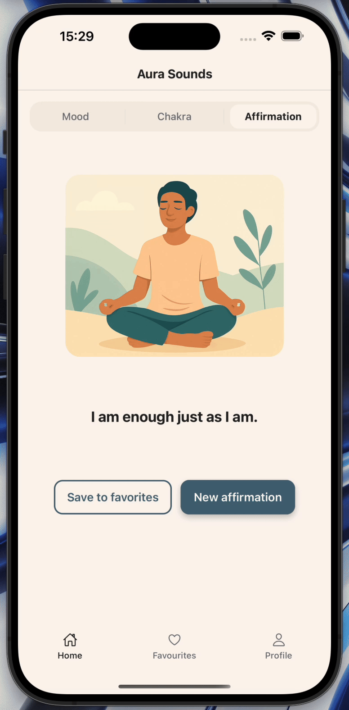

# AuraSounds

**AuraSounds** is a mobile application for restoring inner balance through music, affirmations, and practices related to mood and chakras.

## Features
- Thematic playlists for different emotional states (Calm, Inspired, Focused, Clear, etc.)
- Categories of affirmations and chakras
- Components implemented in the Figma design style with responsive styling

## 📦 Assignment 5: API Integration and Data Handling

This app implements all required steps of the [cross_assignment_5] task:

- ✅ **API Selection:** Since the app theme is focused on mindfulness and affirmations, we used a mock `affirmations.json` file as a local data source (imitating a public REST API).
- ✅ **API Integration:** The logic is modularized into `api.js`, with a simulated `fetchAffirmations()` function that returns Promise-based data.
- ✅ **State Management:** Data is loaded and handled via `useState` in the `AffirmationSection` component.
- ✅ **Data Display:** The affirmation text is shown on the screen with buttons: "Save to favorites" and "New affirmation".
- ✅ **Loading/Error Handling:** Loading state and error messages are shown via `ActivityIndicator` and `Text`.
- ✅ **Navigation:** The component is fully integrated in the `HomeScreen` tab structure via a category switcher.

### 🎥 Demo: Affirmation Switching

